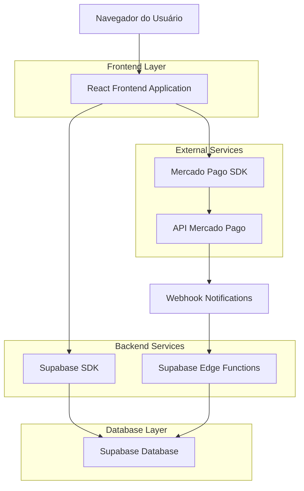
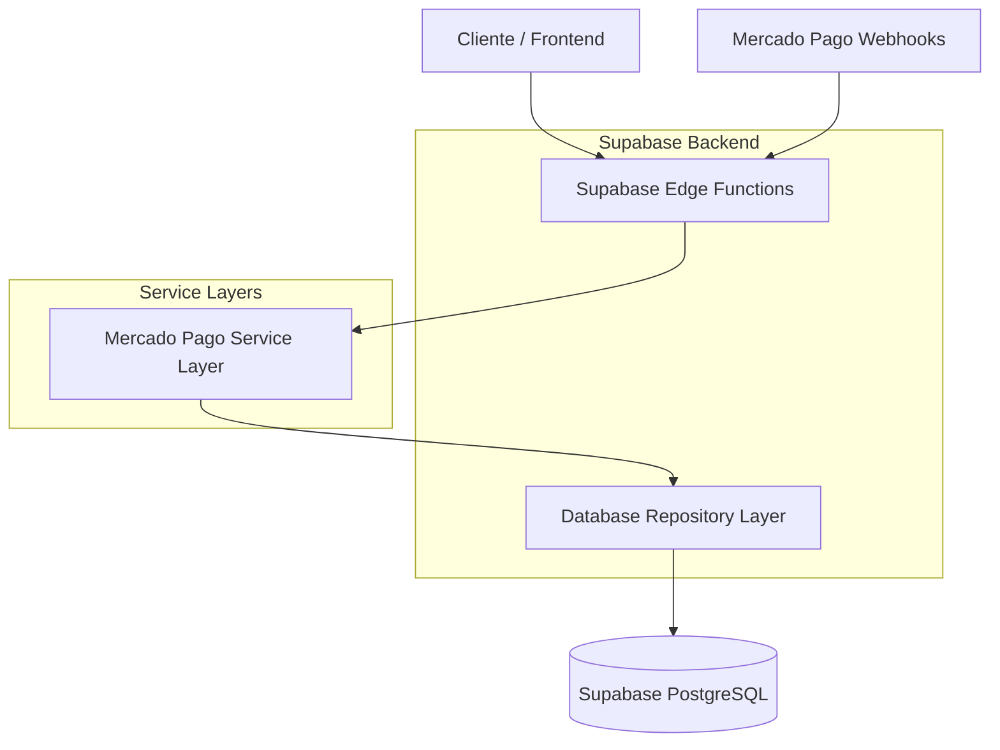
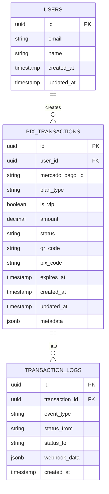

# Arquitetura Técnica - Sistema de Pagamentos PIX

## 1. Design da Arquitetura



## 2. Descrição das Tecnologias

* **Frontend**: React\@18 + TypeScript + TailwindCSS + Vite

* **Backend**: Supabase (PostgreSQL + Edge Functions)

* **Pagamentos**: Mercado Pago SDK + Webhooks

* **Estado**: React Context + useState/useEffect

* **UI Components**: Shadcn/ui + Lucide Icons

## 3. Definições de Rotas

| Rota                          | Propósito                                     |
| ----------------------------- | --------------------------------------------- |
| /plans                        | Página principal de planos com nova opção PIX |
| /plans/pix/:transactionId     | Interface de pagamento PIX com QR code        |
| /plans/success/:transactionId | Página de confirmação de pagamento            |
| /plans/expired/:transactionId | Página de expiração de pagamento              |
| /admin/transactions           | Painel administrativo de transações PIX       |

## 4. Definições de API

### 4.1 APIs Principais

**Criar transação PIX**

```
POST /api/pix/create-transaction
```

Request:

| Nome do Parâmetro | Tipo    | Obrigatório | Descrição                            |
| ----------------- | ------- | ----------- | ------------------------------------ |
| planType          | string  | true        | Tipo do plano: 'monthly' ou 'yearly' |
| isVip             | boolean | true        | Se inclui upgrade VIP                |
| userEmail         | string  | true        | Email do usuário                     |
| amount            | number  | true        | Valor total da transação             |

Response:

| Nome do Parâmetro | Tipo   | Descrição                         |
| ----------------- | ------ | --------------------------------- |
| transactionId     | string | ID único da transação             |
| qrCode            | string | Código QR para pagamento          |
| pixCode           | string | Código PIX alfanumérico           |
| expiresAt         | string | Data/hora de expiração (ISO 8601) |
| amount            | number | Valor da transação                |

Exemplo:

```json
{
  "transactionId": "pix_123456789",
  "qrCode": "00020126580014br.gov.bcb.pix...",
  "pixCode": "PIX123456789ABCDEF",
  "expiresAt": "2024-01-15T15:30:00Z",
  "amount": 68.90
}
```

**Verificar status da transação**

```
GET /api/pix/transaction-status/:transactionId
```

Response:

| Nome do Parâmetro | Tipo   | Descrição                                            |
| ----------------- | ------ | ---------------------------------------------------- |
| status            | string | Status: 'pending', 'approved', 'rejected', 'expired' |
| updatedAt         | string | Última atualização                                   |

**Webhook do Mercado Pago**

```
POST /api/pix/webhook
```

Request (do Mercado Pago):

| Nome do Parâmetro | Tipo    | Descrição           |
| ----------------- | ------- | ------------------- |
| id                | string  | ID da notificação   |
| live\_mode        | boolean | Se é produção       |
| type              | string  | Tipo de notificação |
| date\_created     | string  | Data da criação     |
| application\_id   | string  | ID da aplicação     |
| user\_id          | string  | ID do usuário MP    |
| version           | number  | Versão da API       |
| api\_version      | string  | Versão da API       |
| action            | string  | Ação realizada      |
| data              | object  | Dados da transação  |

## 5. Arquitetura do Servidor



## 6. Modelo de Dados

### 6.1 Definição do Modelo de Dados



### 6.2 Linguagem de Definição de Dados

**Tabela de Transações PIX (pix\_transactions)**

```sql
-- Criar tabela
CREATE TABLE pix_transactions (
    id UUID PRIMARY KEY DEFAULT gen_random_uuid(),
    user_id UUID REFERENCES auth.users(id) ON DELETE CASCADE,
    mercado_pago_id VARCHAR(255) UNIQUE,
    plan_type VARCHAR(20) NOT NULL CHECK (plan_type IN ('monthly', 'yearly')),
    is_vip BOOLEAN DEFAULT FALSE,
    amount DECIMAL(10,2) NOT NULL,
    status VARCHAR(20) DEFAULT 'pending' CHECK (status IN ('pending', 'approved', 'rejected', 'expired', 'cancelled')),
    qr_code TEXT,
    pix_code VARCHAR(255),
    expires_at TIMESTAMP WITH TIME ZONE NOT NULL,
    created_at TIMESTAMP WITH TIME ZONE DEFAULT NOW(),
    updated_at TIMESTAMP WITH TIME ZONE DEFAULT NOW(),
    metadata JSONB DEFAULT '{}'
);

-- Criar índices
CREATE INDEX idx_pix_transactions_user_id ON pix_transactions(user_id);
CREATE INDEX idx_pix_transactions_status ON pix_transactions(status);
CREATE INDEX idx_pix_transactions_created_at ON pix_transactions(created_at DESC);
CREATE INDEX idx_pix_transactions_expires_at ON pix_transactions(expires_at);
CREATE INDEX idx_pix_transactions_mercado_pago_id ON pix_transactions(mercado_pago_id);

-- Permissões RLS
ALTER TABLE pix_transactions ENABLE ROW LEVEL SECURITY;

-- Política para usuários autenticados verem apenas suas transações
CREATE POLICY "Users can view own transactions" ON pix_transactions
    FOR SELECT USING (auth.uid() = user_id);

-- Política para inserção de transações
CREATE POLICY "Users can create own transactions" ON pix_transactions
    FOR INSERT WITH CHECK (auth.uid() = user_id);

-- Política para administradores
CREATE POLICY "Admins can view all transactions" ON pix_transactions
    FOR ALL USING (
        EXISTS (
            SELECT 1 FROM auth.users 
            WHERE auth.users.id = auth.uid() 
            AND auth.users.raw_user_meta_data->>'role' = 'admin'
        )
    );

-- Conceder permissões
GRANT SELECT ON pix_transactions TO anon;
GRANT ALL PRIVILEGES ON pix_transactions TO authenticated;
```

**Tabela de Logs de Transação (transaction\_logs)**

```sql
-- Criar tabela
CREATE TABLE transaction_logs (
    id UUID PRIMARY KEY DEFAULT gen_random_uuid(),
    transaction_id UUID REFERENCES pix_transactions(id) ON DELETE CASCADE,
    event_type VARCHAR(50) NOT NULL,
    status_from VARCHAR(20),
    status_to VARCHAR(20),
    webhook_data JSONB,
    created_at TIMESTAMP WITH TIME ZONE DEFAULT NOW()
);

-- Criar índices
CREATE INDEX idx_transaction_logs_transaction_id ON transaction_logs(transaction_id);
CREATE INDEX idx_transaction_logs_created_at ON transaction_logs(created_at DESC);
CREATE INDEX idx_transaction_logs_event_type ON transaction_logs(event_type);

-- Permissões RLS
ALTER TABLE transaction_logs ENABLE ROW LEVEL SECURITY;

-- Política para administradores
CREATE POLICY "Admins can view all logs" ON transaction_logs
    FOR ALL USING (
        EXISTS (
            SELECT 1 FROM auth.users 
            WHERE auth.users.id = auth.uid() 
            AND auth.users.raw_user_meta_data->>'role' = 'admin'
        )
    );

-- Conceder permissões
GRANT SELECT ON transaction_logs TO anon;
GRANT ALL PRIVILEGES ON transaction_logs TO authenticated;
```

**Função para expirar transações automaticamente**

```sql
-- Função para marcar transações expiradas
CREATE OR REPLACE FUNCTION expire_old_pix_transactions()
RETURNS void AS $$
BEGIN
    UPDATE pix_transactions 
    SET status = 'expired', updated_at = NOW()
    WHERE status = 'pending' 
    AND expires_at < NOW();
END;
$$ LANGUAGE plpgsql;

-- Criar trigger para executar a função periodicamente
-- (Isso seria configurado via cron job ou Edge Function)
```

**Dados iniciais**

```sql
-- Inserir configurações iniciais se necessário
INSERT INTO app_settings (key, value) VALUES 
('mercado_pago_public_key', 'TEST-xxx'),
('mercado_pago_access_token', 'TEST-xxx'),
('pix_expiration_hours', '24'),
('webhook_secret', 'your-webhook-secret')
ON CONFLICT (key) DO NOTHING;
```

## 7. Componentes React Principais

### 7.1 Estrutura de Componentes

```
src/
├── components/
│   ├── pix/
│   │   ├── PixPaymentInterface.tsx
│   │   ├── QRCodeDisplay.tsx
│   │   ├── PixCodeDisplay.tsx
│   │   ├── PaymentTimer.tsx
│   │   ├── PaymentStatus.tsx
│   │   └── PixSelector.tsx
│   └── admin/
│       ├── TransactionsDashboard.tsx
│       ├── TransactionsList.tsx
│       └── PaymentReports.tsx
├── hooks/
│   ├── usePixPayment.ts
│   ├── useTransactionStatus.ts
│   └── usePaymentTimer.ts
├── services/
│   ├── pixService.ts
│   ├── mercadoPagoService.ts
│   └── transactionService.ts
└── types/
    ├── pix.ts
    └── transaction.ts
```

### 7.2 Hooks Customizados

**usePixPayment.ts**

```typescript
export const usePixPayment = () => {
  const [loading, setLoading] = useState(false);
  const [transaction, setTransaction] = useState<PixTransaction | null>(null);
  
  const createPixPayment = async (data: CreatePixPaymentData) => {
    // Implementação
  };
  
  return { createPixPayment, loading, transaction };
};
```

**useTransactionStatus.ts**

```typescript
export const useTransactionStatus = (transactionId: string) => {
  const [status, setStatus] = useState<TransactionStatus>('pending');
  
  useEffect(() => {
    // Polling para verificar status
    const interval = setInterval(checkStatus, 5000);
    return () => clearInterval(interval);
  }, [transactionId]);
  
  return { status };
};
```

## 8. Configurações de Segurança

### 8.1 Variáveis de Ambiente

```env
# Mercado Pago
VITE_MERCADO_PAGO_PUBLIC_KEY=TEST-xxx
MERCADO_PAGO_ACCESS_TOKEN=TEST-xxx
MERCADO_PAGO_WEBHOOK_SECRET=your-secret

# Supabase
VITE_SUPABASE_URL=your-supabase-url
VITE_SUPABASE_ANON_KEY=your-anon-key
SUPABASE_SERVICE_ROLE_KEY=your-service-role-key

# App
VITE_APP_ENV=development
VITE_WHATSAPP_NUMBER=64996028022
```

### 8.2 Configurações de Segurança

* Rate limiting: 10 requests/minute por IP

* Validação de webhook signature

* Sanitização de todos os inputs

* Logs de auditoria para todas as transações

* Criptografia de dados sensíveis em repouso

