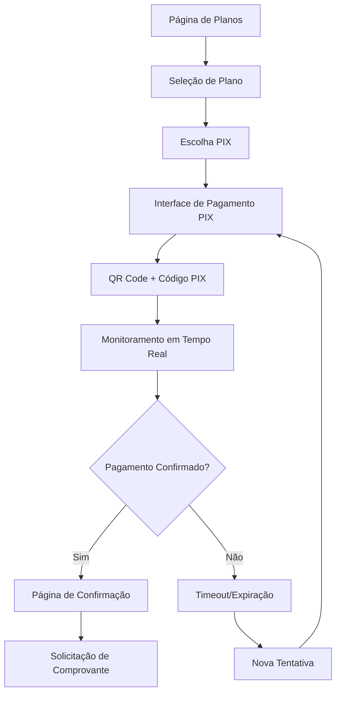

# Sistema de Pagamentos PIX - OneDrip

## 1. Visão Geral do Produto

Implementação de um sistema completo de pagamentos via PIX na seção /plans do OneDrip, integrando-se com a API do Mercado Pago para processamento seguro de transações. O sistema manterá todos os planos e preços existentes, adicionando uma nova opção de pagamento instantâneo via PIX com geração automática de QR codes e códigos únicos.

O objetivo é oferecer aos usuários uma alternativa de pagamento rápida, segura e tipicamente brasileira, aumentando a conversão de vendas e melhorando a experiência do usuário.

## 2. Funcionalidades Principais

### 2.1 Papéis de Usuário

| Papel         | Método de Registro               | Permissões Principais                                                                 |
| ------------- | -------------------------------- | ------------------------------------------------------------------------------------- |
| Cliente       | Acesso direto à página de planos | Pode visualizar planos, selecionar opções e realizar pagamentos via PIX               |
| Administrador | Acesso via painel admin          | Pode visualizar transações, gerenciar configurações de pagamento e acessar relatórios |

### 2.2 Módulos de Funcionalidade

Nossos requisitos do sistema PIX consistem nas seguintes páginas principais:

1. **Página de Planos Atualizada**: seleção de planos, opção PIX, interface de pagamento
2. **Interface de Pagamento PIX**: geração de QR code, código PIX, status da transação
3. **Página de Confirmação**: status do pagamento, instruções pós-pagamento
4. **Painel Administrativo**: gestão de transações, relatórios, configurações

### 2.3 Detalhes das Páginas

| Nome da Página   | Nome do Módulo             | Descrição da Funcionalidade                                              |
| ---------------- | -------------------------- | ------------------------------------------------------------------------ |
| Página de Planos | Seletor de Pagamento       | Adicionar opção PIX junto aos métodos existentes, manter interface atual |
| Página de Planos | Card de Plano              | Preservar todos os preços e opções atuais, adicionar indicador PIX       |
| Interface PIX    | Gerador QR Code            | Gerar QR code único para cada transação via API Mercado Pago             |
| Interface PIX    | Código PIX                 | Gerar código PIX alfanumérico com validade de 24 horas                   |
| Interface PIX    | Monitor de Status          | Verificar status da transação em tempo real, atualizar interface         |
| Interface PIX    | Timer de Validade          | Exibir countdown de 24 horas para expiração do código                    |
| Confirmação      | Notificação de Sucesso     | Confirmar pagamento aprovado, instruções para próximos passos            |
| Confirmação      | Solicitação de Comprovante | Direcionar envio de comprovante para WhatsApp final 22                   |
| Admin            | Painel de Transações       | Listar todas as transações PIX, filtros por status e data                |
| Admin            | Relatórios                 | Gerar relatórios de vendas, conversão e análise de pagamentos            |
| Admin            | Configurações              | Gerenciar credenciais Mercado Pago, configurar webhooks                  |

## 3. Processo Principal

### Fluxo do Cliente:

1. Cliente acessa página de planos
2. Seleciona plano desejado (mensal/anual) e opção VIP se aplicável
3. Escolhe método de pagamento PIX
4. Sistema gera QR code e código PIX únicos
5. Cliente realiza pagamento via app bancário
6. Sistema monitora status em tempo real
7. Confirmação automática após pagamento
8. Redirecionamento para envio de comprovante

### Fluxo Administrativo:

1. Admin acessa painel de transações
2. Visualiza todas as transações em tempo real
3. Monitora status de pagamentos
4. Gera relatórios de performance
5. Configura parâmetros do sistema

## 4. Design da Interface do Usuário

### 4.1 Estilo de Design

* **Cores Primárias**: Manter paleta atual do OneDrip (primary, accent)

* **Cores Secundárias**: Verde para confirmações PIX (#00C851), Laranja para pendências (#FF8800)

* **Estilo de Botões**: Manter estilo atual com gradiente premium para PIX

* **Fonte**: Manter fonte atual do sistema

* **Layout**: Card-based, navegação superior, design responsivo

* **Ícones**: Lucide icons para PIX, QR code, timer, status

### 4.2 Visão Geral do Design das Páginas

| Nome da Página   | Nome do Módulo | Elementos da UI                                                       |
| ---------------- | -------------- | --------------------------------------------------------------------- |
| Página de Planos | Seletor PIX    | Botão PIX com ícone, cor verde #00C851, animação hover                |
| Interface PIX    | QR Code        | Card centralizado, QR code 200x200px, fundo branco, borda arredondada |
| Interface PIX    | Código PIX     | Input readonly, botão copiar, feedback visual de cópia                |
| Interface PIX    | Timer          | Countdown circular, cores degradê vermelho conforme proximidade       |
| Interface PIX    | Status         | Badges coloridos, animações de loading, ícones de status              |
| Confirmação      | Sucesso        | Card verde, ícone check, animação de sucesso                          |
| Admin            | Dashboard      | Tabela responsiva, filtros, gráficos de conversão                     |

### 4.3 Responsividade

O sistema será mobile-first com adaptação completa para desktop. Otimização especial para dispositivos móveis considerando que a maioria dos pagamentos PIX são realizados via smartphone. Interface touch-friendly com botões adequados para interação móvel.

## 5. Requisitos Técnicos

### 5.1 Integração Mercado Pago

* Utilizar SDK oficial do Mercado Pago

* Implementar autenticação via Access Token

* Configurar webhooks para notificações em tempo real

* Gerenciar sandbox/produção via variáveis de ambiente

### 5.2 Segurança

* Criptografia de dados sensíveis (AES-256)

* Validação de transações via webhooks assinados

* Rate limiting para APIs

* Sanitização de inputs

* Logs de auditoria completos

### 5.3 Banco de Dados

* Nova tabela `pix_transactions` no Supabase

* Campos: id, user\_id, plan\_type, amount, status, qr\_code, pix\_code, expires\_at, created\_at

* Índices para performance em consultas por status e data

* Políticas RLS para segurança

### 5.4 Monitoramento

* Logs estruturados para todas as transações

* Métricas de conversão e performance

* Alertas para falhas de pagamento

* Dashboard de monitoramento em tempo real

