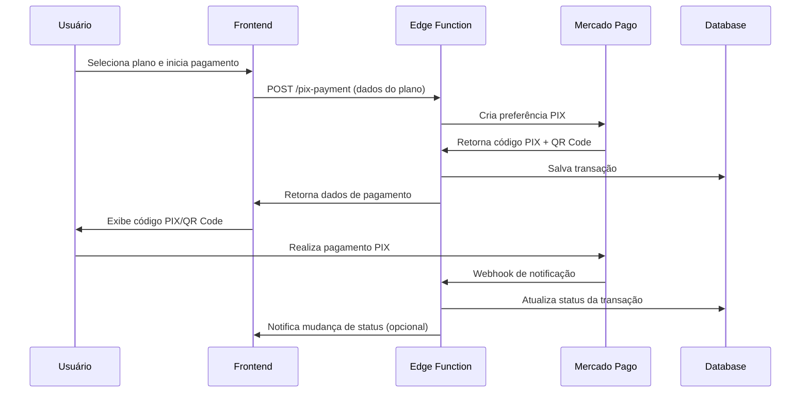

# Sistema de Pagamentos PIX - Documentação Técnica

## 📋 Visão Geral

Sistema integrado de pagamentos PIX utilizando API do Mercado Pago para processamento de assinaturas e licenças da plataforma OneDrip.

## 🏗️ Arquitetura do Sistema

### Componentes Principais

1. **Frontend (React/TypeScript)**
   - Hook `usePixPayment` para gerenciamento de estados
   - Componente `PixPaymentInterface` para interface do usuário
   - Serviço `paymentService` para comunicação com backend

2. **Backend (Supabase Edge Functions)**
   - `pix-payment` - Criação de preferências PIX
   - `pix-status` - Verificação de status de pagamento
   - `pix-webhook` - Processamento de notificações

3. **Banco de Dados (PostgreSQL)**
   - Tabela `pix_transactions` - Armazenamento de transações
   - Tabela `transaction_logs` - Logs de auditoria
   - Políticas RLS para segurança

## 🔄 Fluxo de Pagamento PIX

### Sequência de Operações



## 🔧 Configuração e Credenciais

### Variáveis de Ambiente Necessárias

```bash
# Mercado Pago
VITE_MERCADO_PAGO_ACCESS_TOKEN=your_access_token
VITE_MERCADO_PAGO_PUBLIC_KEY=your_public_key

# Supabase
VITE_SUPABASE_URL=https://your-project.supabase.co
VITE_SUPABASE_PUBLISHABLE_KEY=your_anon_key

# Configurações PIX
VITE_PIX_EXPIRATION_HOURS=24
```

### Configuração do Mercado Pago

1. **Credenciais de Produção:**
   - Access Token: Obtido no dashboard do Mercado Pago
   - Public Key: Chave pública para validações frontend
   
2. **Webhook Configuration:**
   - URL: `https://your-project.supabase.co/functions/v1/pix-webhook`
   - Eventos: `payment`, `merchant_order`

## 🔒 Segurança Implementada

### Validações de Input

- **Email**: Regex validation + sanitização
- **Valores**: Validação de range e formato
- **Tipo de Plano**: Whitelist de valores permitidos

### Políticas RLS (Row Level Security)

```sql
-- Usuários podem apenas ver suas próprias transações
CREATE POLICY "Users can view their own transactions" 
ON pix_transactions FOR SELECT 
USING (auth.uid() = user_id);

-- Apenas serviços podem inserir logs de transação
CREATE POLICY "Service can insert transaction logs" 
ON transaction_logs FOR INSERT 
WITH CHECK (true);
```

### Criptografia de Dados Sensíveis

- Números de telefone criptografados
- Tokens de transação com hash SHA-256
- Dados de pagamento em trânsito via HTTPS

## 📊 Monitoramento e Logging

### Eventos Auditados

1. **Tentativa de Pagamento**
   - Timestamp, email, plano selecionado
   - IP do usuário, user agent

2. **Criação de PIX**
   - ID da transação, valor, status
   - Tempo de resposta da API

3. **Mudanças de Status**
   - Estado anterior/novo
   - Origem da mudança (webhook/manual)

### Métricas Importantes

- **Taxa de Conversão**: Códigos PIX gerados vs. pagamentos aprovados
- **Tempo de Resposta**: Latência da API do Mercado Pago
- **Taxa de Erro**: Falhas na geração de códigos PIX
- **Expiração**: Códigos PIX não utilizados

## 🚨 Tratamento de Erros

### Tipos de Erro Mapeados

```typescript
interface ErrorMapping {
  NETWORK_ERROR: 'Erro de conexão com servidor';
  TIMEOUT_ERROR: 'Tempo limite excedido';
  CREDENTIALS_ERROR: 'Erro de configuração do Mercado Pago';
  PIX_UNAVAILABLE: 'Sistema PIX temporariamente indisponível';
  INVALID_DATA: 'Dados de pagamento inválidos';
  SERVER_ERROR: 'Erro interno do servidor';
}
```

### Estratégia de Retry

1. **Exponential Backoff**: 1s, 2s, 4s entre tentativas
2. **Circuit Breaker**: Pausa temporária após múltiplas falhas
3. **Fallback**: Exibir formulário de contato em caso de falha total

## 📋 Endpoints da API

### POST /functions/v1/pix-payment

**Request:**
```json
{
  "planType": "monthly" | "yearly",
  "isVip": boolean,
  "userEmail": "user@example.com"
}
```

**Response Success:**
```json
{
  "preference_id": "string",
  "qr_code": "string",
  "qr_code_base64": "string",
  "transaction_id": "string",
  "amount": number,
  "expires_at": "ISO-8601"
}
```

**Response Error:**
```json
{
  "error": "string",
  "code": "ERROR_CODE",
  "details": {}
}
```

### GET /functions/v1/pix-status

**Query Parameters:**
- `transaction_id`: ID da transação PIX

**Response:**
```json
{
  "status": "pending|approved|rejected|expired",
  "updated_at": "ISO-8601",
  "payment_details": {}
}
```

## 🧪 Testes e Validação

### Cenários de Teste

1. **Fluxo Completo**
   - Criar PIX → Simular pagamento → Verificar aprovação

2. **Tratamento de Erro**
   - Credenciais inválidas
   - Timeout de rede
   - Valores inválidos

3. **Segurança**
   - Tentativas de acesso não autorizado
   - Manipulação de dados de transação
   - Rate limiting

### Ambiente de Testes

- **Mercado Pago Sandbox**: Ambiente isolado para testes
- **Dados de Teste**: CPFs e valores específicos para simulação
- **Mock Services**: Simulação de webhooks e falhas

## 📈 Performance e Otimização

### Métricas de Performance

- **Tempo de Geração PIX**: < 3 segundos
- **Rate Limit**: 100 requests/minuto por IP
- **Cache**: TTL de 5 minutos para dados de configuração
- **Connection Pool**: Máximo 10 conexões simultâneas

### Otimizações Implementadas

1. **Lazy Loading**: Carregamento sob demanda de componentes PIX
2. **Debounce**: Prevenção de múltiplas submissões
3. **Compression**: Gzip para respostas da API
4. **CDN**: Assets estáticos via CDN

## 🔄 Processo de Deploy

### Checklist de Deploy

- [ ] Validar credenciais de produção do Mercado Pago
- [ ] Verificar configuração de webhooks
- [ ] Executar testes de integração
- [ ] Validar políticas RLS no banco
- [ ] Configurar monitoramento e alertas

### Rollback Strategy

1. **Feature Flag**: Desabilitar PIX via configuração
2. **Database Rollback**: Scripts de reversão de schema
3. **Cache Invalidation**: Limpar cache de configuração

## 📞 Suporte e Troubleshooting

### Problemas Comuns

1. **"Código PIX não gerado"**
   - Verificar credenciais do Mercado Pago
   - Checar logs de erro na Edge Function

2. **"Webhook não recebido"**
   - Validar URL do webhook
   - Verificar firewall e políticas de segurança

3. **"Transação não encontrada"**
   - Confirmar ID da transação
   - Verificar políticas RLS

### Contatos de Suporte

- **Mercado Pago**: developers.mercadopago.com
- **Supabase**: supabase.com/support
- **Equipe Interna**: suporte@onedrip.com.br

## 📊 Dashboard e Relatórios

### Métricas Disponíveis

- Transações por período
- Taxa de conversão PIX
- Valor médio de transação
- Análise de falhas

### Alertas Configurados

- Taxa de erro > 5%
- Tempo de resposta > 10s
- Falha de webhook
- Credenciais próximas ao vencimento

---

**Versão:** 2.0  
**Última Atualização:** Janeiro 2025  
**Responsável:** Equipe de Desenvolvimento OneDrip